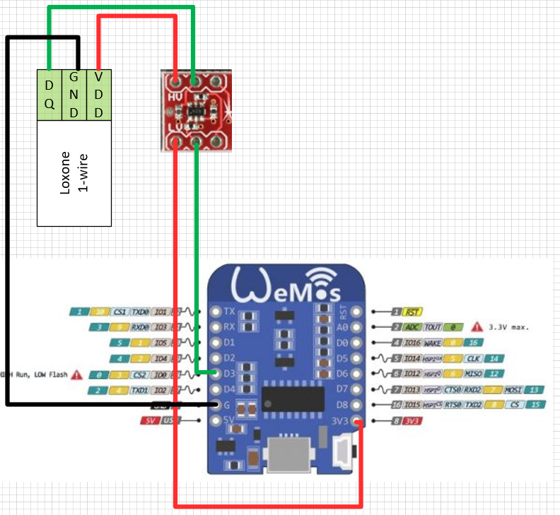

# Purpose of this project

The purpose of this project is to provide a cheap solution to provide the measurement values of Bosch's BME680 sensor via 1-Wire. 

The main purpose is to integrate the BME680 sensor into Loxone via 1-Wire. But there shouldn't be any problems to use the project with other systems out of the box, as 1-Wire is a standardized, commonly used protocol. 

The project was developed for a WEMOS/Lolin D1 mini. But it should work on other ESP8266 microcontrollers too. 

# Wiring



The red thing up there is a level shifter. This is needed because Wemos/Lolin D1 mini works with 1-Wire at 3.3V but Loxone expects 1-Wire at 5V. So the level shifter converts the signals bidirectional. In our setup we [used this article](https://www.watterott.com/de/Level-Shifter), but feel free to use a similar article from another store/manufacturer.

# Compiling the project

## Install Arduino Studio

- https://www.instructables.com/id/Wemos-ESP8266-Getting-Started-Guide-Wemos-101/
Additionally you have to add some linker arguments in the config files of the Arduino Studio linker. The whole process of that you can find in the BME680 manual. You can download that from the [Bosch BSEC library website](https://www.bosch-sensortec.com/bst/products/all_products/bsec). Within the library there is a PDF under 

```
integration_guide/BST-BME680-Integration-Guide-AN008-47.pdf
```
from page 15 and the following pages.

## Install Visual Studio and vMicro 

During development we used those two tools. Maybe there is way to flash the project directly with Arduino Studio. 

Refer to the following guidlines how to use those products: 

- https://www.visualmicro.com/page/User-Guide.aspx?doc=First-steps.html

- https://visualstudio.microsoft.com/de/vs/

## Define the 1-Wire addresses

One of the current major problems is that every value is presented as a separate DS18B20 sensor. That means that every value is presented a separate 1-Wire sensor with a dedicated address. If you want to use more than one sensor on the 1-Wire bus you have to change all four addresses on the second and every following microcontroller before compiling the project. This is because every 1-Wire address has to be uniqe per bus. 

# Future roadmap for this project

1. Store the calibration data of the sensor on the integrated flash storage of the microcontroller.
Refer to [issue #2](https://github.com/gahujipo/BME680-ESP8266-1Wire/issues/2) for more info on that progress. 

2. Publish BME680's data as DS2438. This means that all sensor values get published as a single 1-Wire sensor. Instead of four different sensors with four different addresses. Refer to [issue #1](https://github.com/gahujipo/BME680-ESP8266-1Wire/issues/1) for more info on that progress. 


# Contribution

Feel free to contribute to the project! 